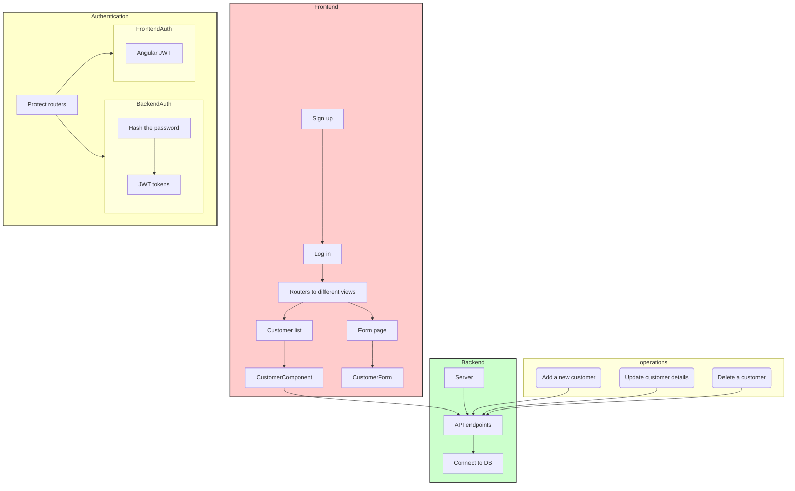

# Back-office-app

```mermaid
graph TD;
    subgraph Frontend
        SignUp[Sign up]
        LogIn[Log in]
        Routers[Routers to different views]
        FormPage[Form page]
        CustomerList[Customer list]
CustomerList --> CustomerComponent
 FormPage --> CustomerForm
    end
    subgraph Backend
        Server[Server]
        API[API endpoints]
        ConnectDB[Connect to DB]
    end
    subgraph operations
        AddCustomer(Add a new customer)
        UpdateCustomer(Update customer details)
        DeleteCustomer(Delete a customer)
    end
    subgraph Authentication
        subgraph BackendAuth
            HashPassword[Hash the password]
            JWT[JWT tokens]
        end
        subgraph FrontendAuth
            AngularJWT[Angular JWT]
        end
        ProtectRouters[Protect routers]
    end
    SignUp --> LogIn
    LogIn --> Routers
    Routers --> FormPage
    Routers --> CustomerList
   
   
    CustomerComponent --> API
    API --> ConnectDB
    Server --> API
    AddCustomer --> API
    UpdateCustomer --> API
    DeleteCustomer --> API
    HashPassword --> JWT
    ProtectRouters --> BackendAuth
    ProtectRouters --> FrontendAuth

    classDef frontendClass fill:#FFCCCC,stroke:#333,stroke-width:2px;
    classDef backendClass fill:#CCFFCC,stroke:#333,stroke-width:2px;
    classDef servicesClass fill:#CCCCFF,stroke:#333,stroke-width:2px;
    classDef authClass fill:#FFFFCC,stroke:#333,stroke-width:2px;

    class Frontend frontendClass;
    class Backend backendClass;
    class Services servicesClass;
    class Authentication authClass;


```
