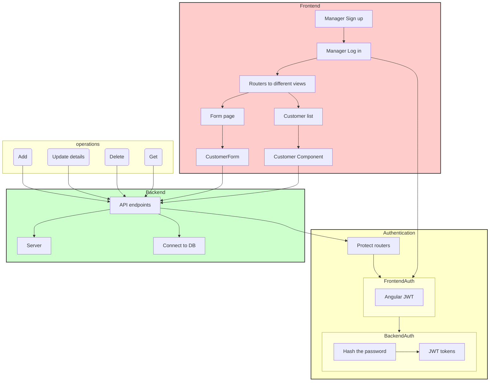

# Back-office-app
<<<<<<< Updated upstream

```mermaid
graph TD;
    subgraph Frontend
        SignUp[Manager Sign up]
        SignUp --> LogIn
        LogIn[Manager Log in]
        LogIn --> Routers
        Routers[Routers to different views]
        Routers --> FormPage
        Routers --> CustomerList
        FormPage[Form page]
        FormPage --> CustomerForm
        CustomerList[Customer list]
        CustomerList --> CustomerComponent
        CustomerComponent[Customer Component]
    end
    subgraph Backend
        Server[Server]
        API[API endpoints]
        ConnectDB[Connect to DB]
    end
    subgraph operations
        AddCustomer(Add)
        UpdateCustomer(Update details)
        DeleteCustomer(Delete)
        GetCustomer(Get)
        AddCustomer --> API
        UpdateCustomer --> API
        DeleteCustomer --> API
        GetCustomer --> API
    end
    subgraph Authentication
        subgraph BackendAuth
            HashPassword[Hash the password]
            JWT[JWT tokens]
            HashPassword --> JWT
        end
        subgraph FrontendAuth
            AngularJWT[Angular JWT]
        end
        ProtectRouters[Protect routers]
        LogIn --> FrontendAuth
        ProtectRouters --> FrontendAuth
FrontendAuth --> BackendAuth

    end

    CustomerComponent --> API
    CustomerForm--> API
    API --> Server
    API --> ConnectDB
    API --> ProtectRouters

    classDef frontendClass fill:#FFCCCC,stroke:#333,stroke-width:2px;
    classDef backendClass fill:#CCFFCC,stroke:#333,stroke-width:2px;
    classDef servicesClass fill:#CCCCFF,stroke:#333,stroke-width:2px;
    classDef authClass fill:#FFFFCC,stroke:#333,stroke-width:2px;

    class Frontend frontendClass;
    class Backend backendClass;
    class Services servicesClass;
    class Authentication authClass;


```
=======
>>>>>>> Stashed changes
